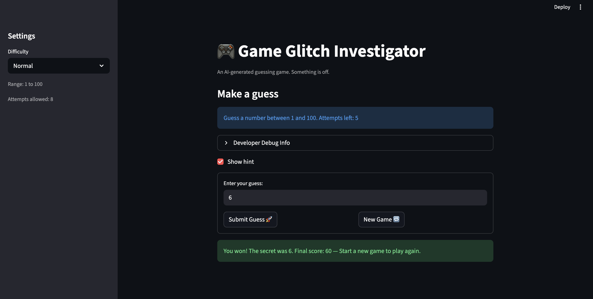

# 🎮 Game Glitch Investigator: The Impossible Guesser

## 🚨 The Situation

You asked an AI to build a simple "Number Guessing Game" using Streamlit.
It wrote the code, ran away, and now the game is unplayable. 

- You can't win.
- The hints lie to you.
- The secret number seems to have commitment issues.

## 🛠️ Setup

1. Install dependencies: `pip install -r requirements.txt`
2. Run the broken app: `python -m streamlit run app.py`

## 🕵️‍♂️ Your Mission

1. **Play the game.** Open the "Developer Debug Info" tab in the app to see the secret number. Try to win.
2. **Find the State Bug.** Why does the secret number change every time you click "Submit"? Ask ChatGPT: *"How do I keep a variable from resetting in Streamlit when I click a button?"*
3. **Fix the Logic.** The hints ("Higher/Lower") are wrong. Fix them.
4. **Refactor & Test.** - Move the logic into `logic_utils.py`.
   - Run `pytest` in your terminal.
   - Keep fixing until all tests pass!

## 📝 Document Your Experience

**Purpose:** A number guessing game where the player tries to guess a secret number within a limited number of attempts, with hints and a score system.

**Bugs found:**
- Hints were backwards — "Go HIGHER!" showed when the guess was too high
- New Game button did not reset game status, leaving the game stuck after a win or loss
- Attempts counter started at 1 instead of 0, making the first attempt display incorrectly
- Every guess from the 2nd onward required two button presses due to a Streamlit form rerun issue
- Invalid guesses (empty input, non-numbers) incorrectly consumed an attempt
- Score rewarded wrong guesses (+5 on even attempts for "Too High")
- History, score, and attempts left showed stale values until the next guess
- Hints disappeared after the first guess once `st.rerun()` was added

**Fixes applied:**
- Swapped the hint messages in `check_guess` in `logic_utils.py`
- Reset all session state fields (status, score, history, hint) in the New Game handler
- Changed attempts initialization from 1 to 0
- Wrapped the text input and submit button in `st.form` to batch interactions into one rerun
- Moved the attempts increment inside the valid-guess branch
- Removed the even/odd scoring branch so all wrong guesses deduct 5 points consistently
- Added `st.rerun()` after each normal guess to refresh display values immediately
- Stored the hint in `st.session_state.last_hint` so it persists across reruns
- Added `max(0, ...)` floor to prevent score from going negative
- Refactored all game logic into `logic_utils.py` and added pytest coverage

## 📸 Demo

- 
